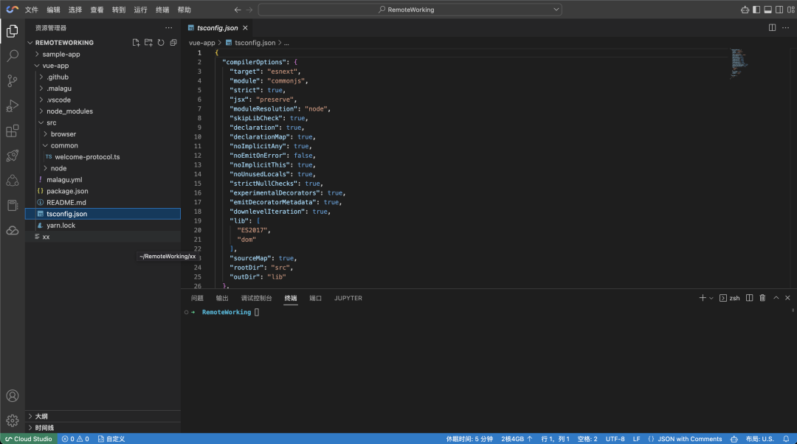

<!-- # 更高效便捷的开发体验——Cloud Studio 编辑器命令行工具 -->
<font color="#dddd00" size="6">更高效便捷的开发体验——Cloud Studio 编辑器命令行工具</font><br /> 

**杨苏博** [腾讯云CloudStudio] *2023-04-06 15:00* *发表于广东*

- [原文地址_与演示视频](https://mp.weixin.qq.com/s/SLceBpF22kamAwX8ySlnQw)
- 在使用cloudstudio的过程中,如果遇到有关cloudstudio.net自身的使用疑问
<!-- - 敬请加入如下的cloudstudio官方微信群(本二维码截止2023年07月14日有效) -->
- <font color="#dddd00" size="2">敬请加入如下的cloudstudio官方微信群(本二维码,截止2023年07月14日有效)</font><br /> 

<!--  -->


- Cloud Studio 是一个云端在线开发平台,在 Cloud Studio 的控制台页面中,可以方便快捷创建或者打开一个工作空间.
- **工作空间提供了在线编辑器给大家访问远端开发环境** .
- 大部分开发时间都与这个在线编辑器打交道,在线编辑器效果如下图所示:



<!-- ## 通过该在线编辑器,可以使用编辑器 UI 进行如下操作 : -->
<font color="#dddd00" size="4">通过该在线编辑器,可以使用编辑器 UI 进行如下操作</font><br /> 

1.打开指定目录或者文件;

2.安装/卸载/查询编辑器插件;

3.创建新文件;

4.DIFF 和合并两个不同的文件等操作.

- 编辑器 UI 交互方式,虽然已经足够使用,但是 Cloud Studio 还提供了一个内置的编辑器命令行工具:cloudstudio.
- 这个命令名称较长,所以还提供了一个简短的别名叫:cs.
- 如果使用过 vscode 编辑器提供的 code 命令,那就能无缝切换到 cloudstudio 命令的使用,cloudstudio 和 code 命令几乎一样.
- 通过这个编辑器命令行工具,也能实现上述编辑器 UI 交互方式的一些操作.
- 命令行操作方式在一些场景中相对更加方便快捷.
- 同时,还可以结合 shell 脚本做一些自动化的操作.

执行如下命令查看帮助信息:

```
cloudstudio -h
# 或者
cs -h
```

执行如下命令打开指定文件或者目录:

```
cloudstudio /foo/bar
# 或者
cs /foo/bar
```

执行如下命令管理插件:

```
# 安装插件命令
cloudstudio --install-extension vscode.csharp@1.2.3
# 查看已安装的插件命令
cloudstudio --list-extensions
# 卸载插件命令
cloudstudio--uninstall-extension vscode.csharp@1.2.3
```

执行如下命令创建一个文件:

```
cloudstudio --add bar
# 或者
cs --add bar
```

执行如下命令打开指定文件并定位到文件内容行列位置:

```
cloudstudio --goto /foo/bar:10:20
# 或者
cs --goto /foo/bar:10:20
```

- 除了上面这些常用的命令,编辑器命令行工具 cloudstudio 还有更多高阶命令,
- 还可以通过 cloudstudio -h 帮助命令查看详细信息.

```bash
cloudstudio 1.79.0

Usage: cloudstudio [options][paths...]

To read from stdin, append '-' (e.g. 'ps aux | grep code | cloudstudio -')

Options
  -d --diff <file> <file>                    Compare two files with each
                                             other.
  -m --merge <path1> <path2> <base> <result> Perform a three-way merge by
                                             providing paths for two modified
                                             versions of a file, the common
                                             origin of both modified versions
                                             and the output file to save merge
                                             results.
  -a --add <folder>                          Add folder(s) to the last active
                                             window.
  -g --goto <file:line[:character]>          Open a file at the path on the
                                             specified line and character
                                             position.
  -n --new-window                            Force to open a new window.
  -r --reuse-window                          Force to open a file or folder in
                                             an already opened window.
  -w --wait                                  Wait for the files to be closed
                                             before returning.
  -h --help                                  Print usage.

Extensions Management
  --list-extensions                   List the installed extensions.
  --show-versions                     Show versions of installed extensions,
                                      when using --list-extensions.
  --category <category>               Filters installed extensions by provided
                                      category, when using --list-extensions.
  --install-extension <ext-id | path> Installs or updates an extension. The
                                      argument is either an extension id or a
                                      path to a VSIX. The identifier of an
                                      extension is '${publisher}.${name}'. Use
                                      '--force' argument to update to latest
                                      version. To install a specific version
                                      provide '@${version}'. For example:
                                      'vscode.csharp@1.2.3'.
  --uninstall-extension <ext-id>      Uninstalls an extension.

Troubleshooting
  -v --version Print version.
  --verbose    Print verbose output (implies --wait).
  -s --status  Print process usage and diagnostics information.


```

[点击这里_文章中_有使用cloudstudio命令行的演示视频](https://mp.weixin.qq.com/s/SLceBpF22kamAwX8ySlnQw)

<!-- 腾云扣钉cloudstudio企业微信群已满 -->
<!--  -->

<!-- #### 在使用cloudstudio的过程中,如果遇到有关cloudstudio.net自身的使用疑问,敬请加入如下的cloudstudio官方微信群

 -->